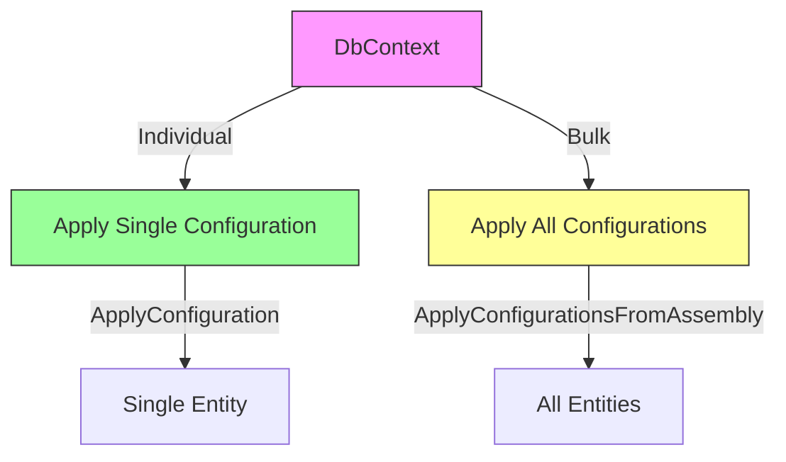
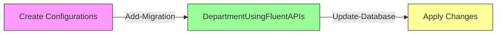
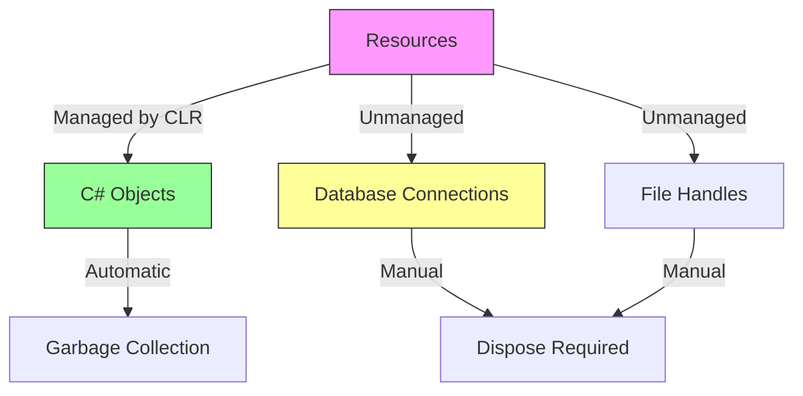
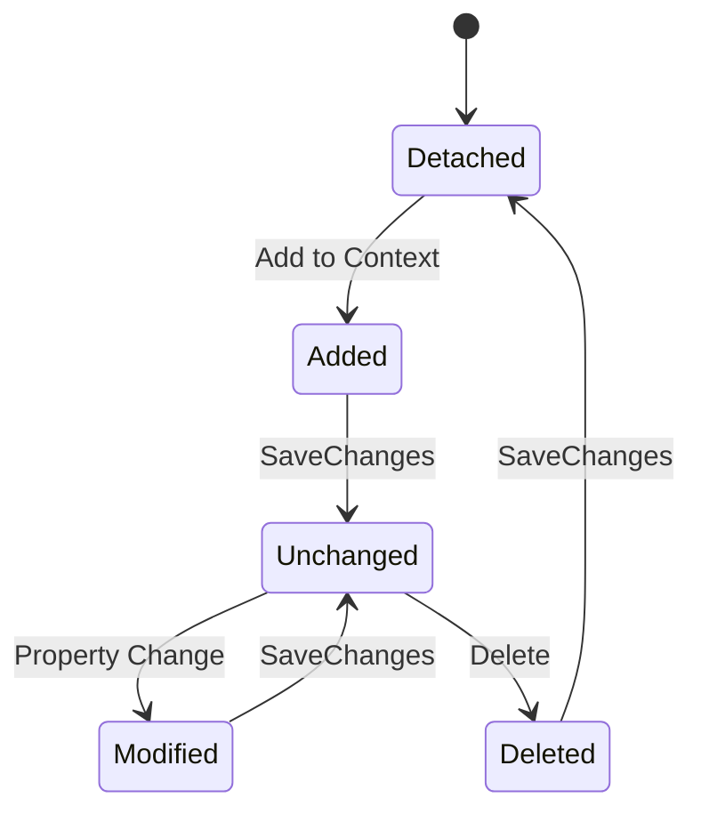

# Entity Framework Core Fluent API Configuration Approaches

## Table of Contents
- [Basic DbSet Configuration](#basic-dbset-configuration)
- [OnModelCreating Configuration](#onmodelcreating-configuration)
- [Entity Builder Lambda](#entity-builder-lambda)
- [Separate Configuration Classes](#separate-configuration-classes)
- [Migration Process](#migration-process)

## Basic DbSet Configuration

```csharp
public class CompanyDbContext : DbContext
{
    public DbSet<Department> Departments { get; set; }
}
```

## OnModelCreating Configuration

### Table and Schema Configuration
```csharp
protected override void OnModelCreating(ModelBuilder modelBuilder)
{
    modelBuilder.Entity<Department>()
        .ToTable("Departments", "dbo");  // Can also map to View or Function
}
```

### Complete Entity Configuration Example
```csharp
protected override void OnModelCreating(ModelBuilder modelBuilder)
{
    modelBuilder.Entity<Department>()
        // Primary Key Configuration
        .HasKey(nameof(Department.DeptId))
        .UseIdentityColumn(10, 10);  // Starts at 10, increments by 10

    modelBuilder.Entity<Department>()
        // Property Configurations
        .Property(d => d.Name)
        .IsRequired()
        .HasColumnType("varchar")
        .HasColumnName("DepartmentName")
        .HasMaxLength(50)
        //.HasAnnotation("MaxLength", 50)
        .HasDefaultValue("Test");

    modelBuilder.Entity<Department>()
        // Computed Column
        .Property(d => d.DateOfCreation)
        .HasComputedColumnSql("GETDATE()");
}
```

## Entity Builder Lambda
```csharp
// EF Core 3.1+ Approach
protected override void OnModelCreating(ModelBuilder modelBuilder)
{
    modelBuilder.Entity<Department>(e => 
    {
        e.ToTable("Departments", "dbo");
        e.HasKey(d => d.DeptId);
        e.Property(d => d.Name)
            .IsRequired()
            .HasColumnType("varchar")
            .HasMaxLength(50);
        e.Property(d => d.DateOfCreation)
            .HasComputedColumnSql("GETDATE()");
    });
}
```

## Separate Configuration Classes

### Project Structure
```
YourProject/
├── Configuration/
│   ├── DepartmentConfiguration.cs
│   ├── EmployeeConfiguration.cs
│   └── ...
```

### Configuration Class Implementation
```csharp
public class DepartmentConfiguration : IEntityTypeConfiguration<Department>
{
    public void Configure(EntityTypeBuilder<Department> builder)
    {
        builder.ToTable("Departments", "dbo");

        builder.HasKey(d => d.DeptId)
               .UseIdentityColumn(10, 10);

        builder.Property(d => d.Name)
               .IsRequired()
               .HasColumnType("varchar")
               .HasColumnName("DepartmentName")
               .HasMaxLength(50)
               .HasDefaultValue("Test");

        builder.Property(d => d.DateOfCreation)
               .HasComputedColumnSql("GETDATE()");
    }
}
```

### Applying Configurations



#### Individual Configuration
```csharp
protected override void OnModelCreating(ModelBuilder modelBuilder)
{
    modelBuilder.ApplyConfiguration(new DepartmentConfiguration());
}
```

#### Bulk Configuration using Reflection
```csharp
protected override void OnModelCreating(ModelBuilder modelBuilder)
{
    modelBuilder.ApplyConfigurationsFromAssembly(typeof(CompanyDbContext).Assembly);
}
```

## Migration Process



### Migration Commands
```powershell
# Create migration
Add-Migration DepartmentUsingFluentAPIs

# Apply changes to database
Update-Database
```

## Best Practices

1. **Configuration Organization**
   - One configuration class per entity
   - Use meaningful class names
   - Group related configurations

2. **Code Maintainability**
   - Prefer separate configuration classes
   - Use bulk configuration when possible
   - Document complex configurations

3. **Property Configuration**
   ```csharp
   builder.Property(x => x.PropertyName)  // Use lambda for type safety
         .HasColumnName("DatabaseColumn") // Be explicit about column names
         .IsRequired()                    // Be explicit about constraints
         .HasColumnType("varchar(50)");   // Be explicit about types
   ```

4. **Migration Strategy**
   - Review migrations before applying
   - Test migrations in development
   - Document significant changes

## Notes
- Separate configuration classes improve maintainability
- Bulk configuration reduces boilerplate code
- Consider using computed columns when appropriate
- Always review generated migrations
- Test configurations thoroughly before deployment


# Entity Framework Core Database Operations and Connection Management

## Table of Contents
- [Database Connection Management](#database-connection-management)
- [Working with DbContext](#working-with-dbcontext)
- [Entity States](#entity-states)
- [Adding Entities](#adding-entities)
- [Best Practices](#best-practices)

## Database Connection Management

### Understanding Managed vs Unmanaged Resources



### Connection Disposal Approaches

#### 1. Traditional Try-Finally
```csharp
CompanyDbContext dbContext = new CompanyDbContext();
try
{
    // CRUD Operations
}
finally
{
    // Close Database Connection
    dbContext.Dispose();
}
```

#### 2. Using Statement (C# Traditional)
```csharp
using (CompanyDbContext dbContext = new CompanyDbContext())
{
    // CRUD Operations
}
```

#### 3. Using Declaration (C# Modern)
```csharp
using CompanyDbContext dbContext = new CompanyDbContext();
// CRUD Operations
// Disposed automatically at end of scope
```

## Entity States

### State Enum Values

| State | Description |
|-------|-------------|
| Detached | No tracking by context |
| Unchanged | Tracked, no changes |
| Added | New entity, pending insert |
| Modified | Existing entity, pending update |
| Deleted | Existing entity, pending deletion |



## Adding Entities

### Example Entities
```csharp
Employee E01 = new Employee() 
{
    Name = "Ahmed",
    Age = 22,
    Salary = 5_000,
    EmailAddress = "ahmed@gmail.com"
};

Employee E02 = new Employee() 
{
    Name = "Yassmin",
    Age = 26,
    Salary = 8_000,
    EmailAddress = "Yassmin@gmail.com"
};
```

### Adding Methods Comparison

| Method | Code Example | Notes |
|--------|--------------|-------|
| DbSet Add | `dbContext.Employees.Add(E01)` | Using DbSet property |
| Generic Set | `dbContext.Set<Employee>().Add(E01)` | When no DbSet defined |
| Context Add | `dbContext.Add(E01)` | EF Core 3.1+ feature |
| State Change | `dbContext.Entry(E01).State = EntityState.Added` | Direct state manipulation |

### Checking Entity State
```csharp
// Check current state
Console.WriteLine(dbContext.Entry(E01).State); // Initially Detached
```

## Best Practices

### 1. Resource Management
```csharp
// ✅ Recommended
using var dbContext = new CompanyDbContext();
// Operations here
// Automatic disposal at end of scope

// ❌ Avoid
var dbContext = new CompanyDbContext();
// Operations without disposal
```

### 2. Entity State Management
```csharp
// Check state before operations
if (dbContext.Entry(entity).State == EntityState.Detached)
{
    dbContext.Add(entity);
}
```

### 3. Bulk Operations
```csharp
// Adding multiple entities
using var dbContext = new CompanyDbContext();
var entities = new List<Employee> { E01, E02 };
dbContext.Employees.AddRange(entities);
```

## Performance Considerations

1. **Connection Management**
   - Use short-lived contexts
   - Dispose properly
   - Consider connection pooling

2. **State Tracking**
   ```csharp
   // Disable tracking for read-only operations
   using var dbContext = new CompanyDbContext();
   var employees = dbContext.Employees
       .AsNoTracking()
       .ToList();
   ```

3. **Bulk Operations**
   - Use AddRange instead of multiple Add calls
   - Consider batch size for large operations

## Common Patterns

### Repository Pattern Example
```csharp
public class EmployeeRepository : IDisposable
{
    private readonly CompanyDbContext _context;

    public EmployeeRepository()
    {
        _context = new CompanyDbContext();
    }

    public void Add(Employee employee)
    {
        _context.Employees.Add(employee);
        _context.SaveChanges();
    }

    public void Dispose()
    {
        _context.Dispose();
    }
}
```

## Notes
- Always dispose of DbContext properly
- Understand entity state for effective tracking
- Use appropriate adding method based on scenario
- Consider performance implications of tracking
- Use modern C# features for cleaner code
