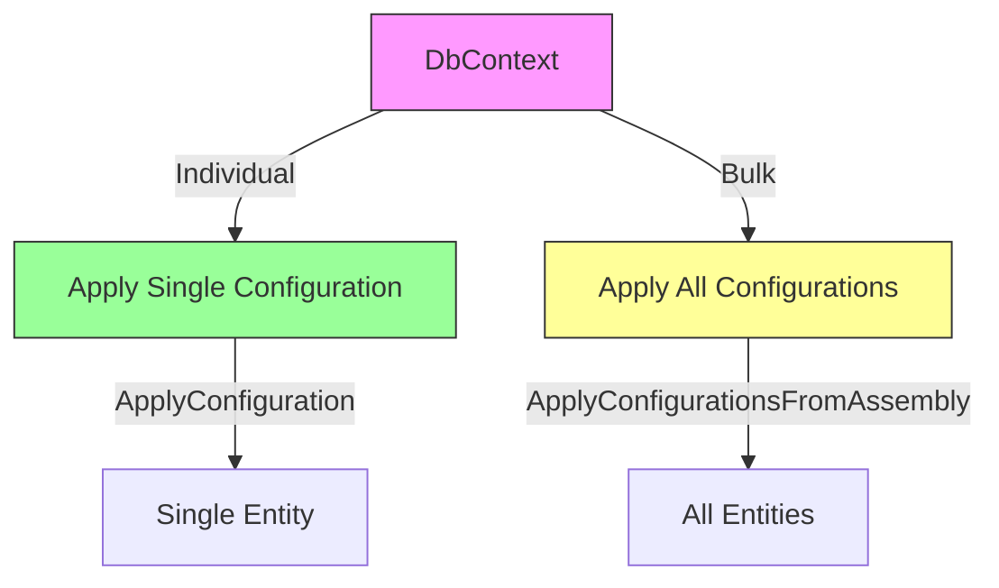
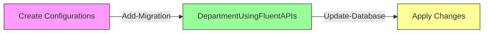

# Entity Framework Core Fluent API Configuration Approaches

## Table of Contents
- [Basic DbSet Configuration](#basic-dbset-configuration)
- [OnModelCreating Configuration](#onmodelcreating-configuration)
- [Entity Builder Lambda](#entity-builder-lambda)
- [Separate Configuration Classes](#separate-configuration-classes)
- [Migration Process](#migration-process)

## Basic DbSet Configuration

```csharp
public class CompanyDbContext : DbContext
{
    public DbSet<Department> Departments { get; set; }
}
```

## OnModelCreating Configuration

### Table and Schema Configuration
```csharp
protected override void OnModelCreating(ModelBuilder modelBuilder)
{
    modelBuilder.Entity<Department>()
        .ToTable("Departments", "dbo");  // Can also map to View or Function
}
```

### Complete Entity Configuration Example
```csharp
protected override void OnModelCreating(ModelBuilder modelBuilder)
{
    modelBuilder.Entity<Department>()
        // Primary Key Configuration
        .HasKey(nameof(Department.DeptId))
        .UseIdentityColumn(10, 10);  // Starts at 10, increments by 10

    modelBuilder.Entity<Department>()
        // Property Configurations
        .Property(d => d.Name)
        .IsRequired()
        .HasColumnType("varchar")
        .HasColumnName("DepartmentName")
        .HasMaxLength(50)
        //.HasAnnotation("MaxLength", 50)
        .HasDefaultValue("Test");

    modelBuilder.Entity<Department>()
        // Computed Column
        .Property(d => d.DateOfCreation)
        .HasComputedColumnSql("GETDATE()");
}
```

## Entity Builder Lambda
```csharp
// EF Core 3.1+ Approach
protected override void OnModelCreating(ModelBuilder modelBuilder)
{
    modelBuilder.Entity<Department>(e => 
    {
        e.ToTable("Departments", "dbo");
        e.HasKey(d => d.DeptId);
        e.Property(d => d.Name)
            .IsRequired()
            .HasColumnType("varchar")
            .HasMaxLength(50);
        e.Property(d => d.DateOfCreation)
            .HasComputedColumnSql("GETDATE()");
    });
}
```

## Separate Configuration Classes

### Project Structure
```
YourProject/
├── Configuration/
│   ├── DepartmentConfiguration.cs
│   ├── EmployeeConfiguration.cs
│   └── ...
```

### Configuration Class Implementation
```csharp
public class DepartmentConfiguration : IEntityTypeConfiguration<Department>
{
    public void Configure(EntityTypeBuilder<Department> builder)
    {
        builder.ToTable("Departments", "dbo");

        builder.HasKey(d => d.DeptId)
               .UseIdentityColumn(10, 10);

        builder.Property(d => d.Name)
               .IsRequired()
               .HasColumnType("varchar")
               .HasColumnName("DepartmentName")
               .HasMaxLength(50)
               .HasDefaultValue("Test");

        builder.Property(d => d.DateOfCreation)
               .HasComputedColumnSql("GETDATE()");
    }
}
```

### Applying Configurations



#### Individual Configuration
```csharp
protected override void OnModelCreating(ModelBuilder modelBuilder)
{
    modelBuilder.ApplyConfiguration(new DepartmentConfiguration());
}
```

#### Bulk Configuration using Reflection
```csharp
protected override void OnModelCreating(ModelBuilder modelBuilder)
{
    modelBuilder.ApplyConfigurationsFromAssembly(typeof(CompanyDbContext).Assembly);
}
```

## Migration Process



### Migration Commands
```powershell
# Create migration
Add-Migration DepartmentUsingFluentAPIs

# Apply changes to database
Update-Database
```

## Best Practices

1. **Configuration Organization**
   - One configuration class per entity
   - Use meaningful class names
   - Group related configurations

2. **Code Maintainability**
   - Prefer separate configuration classes
   - Use bulk configuration when possible
   - Document complex configurations

3. **Property Configuration**
   ```csharp
   builder.Property(x => x.PropertyName)  // Use lambda for type safety
         .HasColumnName("DatabaseColumn") // Be explicit about column names
         .IsRequired()                    // Be explicit about constraints
         .HasColumnType("varchar(50)");   // Be explicit about types
   ```

4. **Migration Strategy**
   - Review migrations before applying
   - Test migrations in development
   - Document significant changes

## Notes
- Separate configuration classes improve maintainability
- Bulk configuration reduces boilerplate code
- Consider using computed columns when appropriate
- Always review generated migrations
- Test configurations thoroughly before deployment
